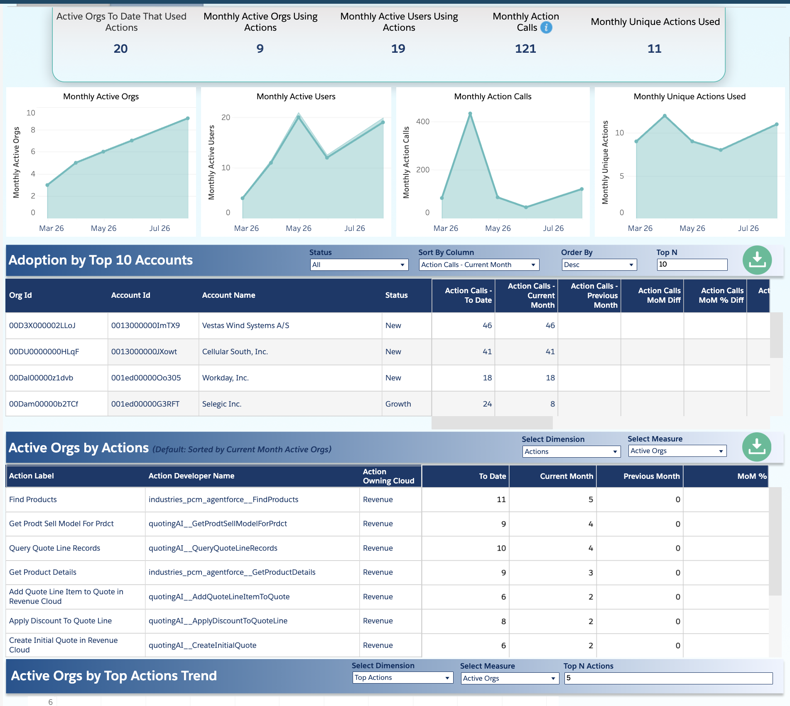

# Agentforce Support Readiness Pod — Project Proposal

> **"Our customers are already using Agentforce. They will log cases. Right now those cases land randomly with whoever picks up the queue. This proposal says: let's get ahead of that curve, build the readiness now, and turn every support case into a product signal — before we're reacting to a flood."**

---

## The Problem

Customers across Industries and Revenue Cloud are actively using Agentforce today. When they hit a gap or a blocker, they log a support case. Those cases currently have no dedicated routing, no trained ownership, and no structured path back to the product team.

Revenue Cloud is the example that proves it is already happening — but this pattern applies across all clouds and all GEOs.

---

## What the Data Shows

*(As of Aug 21, 2026 — Revenue Cloud Agentforce Actions Dashboard)*

  

| Signal | What it means |
|---|---|
| **20 orgs** used Agentforce actions YTD | Real customers, real usage, right now |
| **9 orgs** active this month | Month-on-month growth trend is upward |
| **121 action calls** this month | Core production flows in use — not experiments |
| Top actions: Find Products, Query Quote Lines, Get Product Details, Apply Discount | Customers are running quoting and product workflows via Agentforce |
| Vestas (46 calls), Cellular South (41), Workday (18), Selegic (24) | Named accounts already dependent on these actions |
| Trending at **8.4% vs 10% adoption target** | Gap is small — volume will only grow |
| **14 support cases** already logged on Agentforce blockers in Revenue Cloud alone | Support demand exists today, not in future |

---

## The Proposal — 3 Components

### 1. Create a Dedicated P&T Topic for Agentforce

- Establish **Agentforce as a standalone Product & Topic (P&T) category** across Industries and Revenue Cloud
- Assign a **named product sponsor per cloud** to receive VOC reports and functionality gap summaries
- Today there is no structured path from a support case to the product team for Agentforce issues — this creates one

### 2. Automated Case Routing to a Readiness Pod

- Build an **automated trigger**: any case with Agentforce-related signals (product topic, subject keywords, action names) routes immediately to the pod
- Automation **alerts pod members** at point of case creation — no manual triage, no queue randomness
- Pod covers **all GEOs** with trained engineers assigned by region (start with 3–5 engineers globally)
- SPOC enforced by design — one engineer owns the case from open to close

### 3. Structured VOC Feedback Loop — Case → VOC → P&T

- Every Agentforce case tagged against a VOC category at close
- Pod lead produces a **monthly summary**: top blockers, case count, affected accounts — delivered directly to the product sponsor
- Sync cadence **starts monthly; increases to weekly as volume grows**
- This becomes the earliest signal of adoption friction before it becomes escalation risk

---

## Why Raise This Today

This proposal directly addresses all 4 agenda items from today's leadership discussion:

| Agenda Item | How This Proposal Answers It |
|---|---|
| **Demand trends + future modeling** | Agentforce case volume will grow with adoption — the pod scales ahead of the curve, not behind it |
| **SPOC compliance** | Pod model enforces SPOC by design — trained engineers, owned cases, clear accountability |
| **AgF complexity handled by humans** | Agentforce-adjacent cases are exactly the high-complexity, novel work humans will own as AI deflects the routine |
| **Synchronous statistics — future state** | Pod creates a new leading indicator: Agentforce case volume by action type, tracked weekly across all GEOs |

---

## What to Ask For

1. Endorsement to **pilot the Agentforce Support Readiness Pod** — 90 day trial across all GEOs
2. A **named product sponsor** from each cloud (Revenue, Industries) to receive the monthly VOC feed
3. **Automated routing rule** for Agentforce case identification and pod alert
4. Creation of **Agentforce as a formal P&T topic** in the case taxonomy

---

*Proposal raised: Aug 27, 2026 — CSG Leadership Call*
